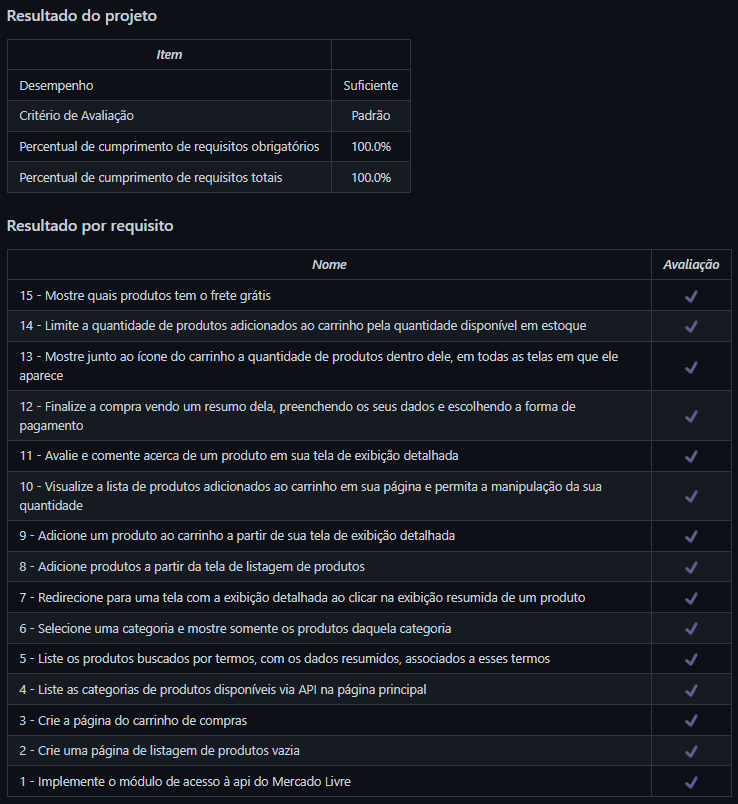

# FrontEnd Online Store
Projeto da [Trybe](https://www.betrybe.com/) - Bloco 13 - Aplicação de loja virtual feita com React.

## 💻 Projeto

Aplicação simplificada, sem persistência em banco de dados, de uma loja online, em que é possível:

- Buscar produtos por termos e categorias a partir da API do Mercado Livre;
- Interagir com os produtos buscados de modo a adicioná-los e removê-los de um carrinho de compras em diferentes quantidades;
- Visualizar detalhes e avaliações prévias de um produto, bem como criar novas avaliações;
- Finalizar a compra (simulada) dos itens selecionados.

<details>
  <summary><strong>🏆 Meu desempenho</strong></summary><br />

  
</details>

## 🚀 Tecnologias
> Este projeto foi desenvolvido com as seguintes tecnologias:

- JavaScript
- React

## 📌 Habilidades

> Neste projeto, desenvolvi as seguintes habilidades:

- Utilizar Metodologias Ágeis, Kanban e Scrum;
- Praticar as habilidades desenvolvidas até o Bloco 12 do módulo de Front-End, como a utilização de React, React Router, consumo de APIs, etc.

## ⬇️ Instalando dependências

```bash
npm install
``` 

## ⚡ Executando a aplicação

```bash
npm start
``` 

## 🧪 Executando os testes

```bash
npm test
```

## 💬 Contatos

<div align="center" style="display: inline_block">
  <a href="https://julianoboese.github.io" target="_blank"></a> 
  <a href="https://www.linkedin.com/in/julianoboese" target="_blank"></a> 
  <a href = "mailto:juliano.boese@gmail.com"></a>
</div>

<!-- ## 📄 Licença

Esse projeto está sob licença. Veja o arquivo [LICENÇA](LICENSE.md) para mais detalhes.

[⬆ Voltar ao topo](#nome-do-projeto)<br> -->
